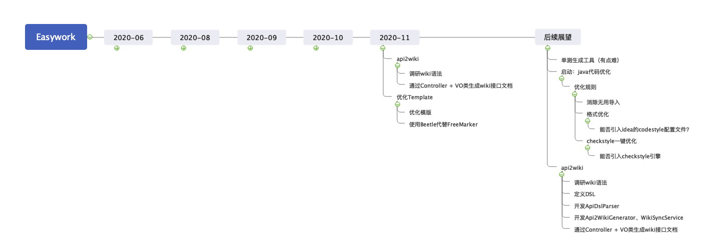

# EasyWork

## 介绍
生成一些模板代码，减少重复工作

## QuickStart
### 简单使用
进入easywork-generator模块，修改nil.ed.easywork.generator.boot.PowerSqlToJavaGenericGeneratorBootStrap文件，修改见代码文件注释。
### 使用Comment Description DSL


Comment Description使用`{{}}`声明描述，函数之间使用'&'进行分隔，描述内容主要包含两种函数：
#### list

```
list[值声明2(值),值声明2(值)]
```
值声明：
name  - 定义该列对应在Condition类中变量名称，当后缀为Set、Collection、List等时，条件运算符将会自动确认为`in`，设置op无效

type  - 定义该列对应在Condition类中变量类型

query - 定义query条件，一般用于query模糊搜索或者query精确搜索

op    - 定义条件运算符

优先级：query > name suffix > normal

一、该函数声明该列对应Condition条件，比如
```sql
`operation_status` tinyint(4) default '1' not null comment '操作类型：1-正常 2-删除{{
	list[name(auditStatusSet),type(Collection<Integer>)]
	}}'
```
该声明会生成下面的Condtion条件: 
```java
@Data
public class XXXQueryCondition {
    private Collection<Integer> auditStatusSet;

    public XXXQueryCondition setAuditStatus(Integer auditStatus) {
        if (auditStatus != null) {
            auditStatusSet = Collections.singleton(auditStatus);
        }
        return this;
    }
}
```
Mapper xml
```xml
<sql id="BASE_CONDITION">
    <where>
        <if test = "auditStatusSet != null">
            `operation_status` in
            <foreach collection="auditStatusSet" item="item" open="(" close=")" separator=",">
            #{item}
            </foreach>
        </if>
    </where>
</sql>
```

二、使用query
```sql
`id` BIGINT(20) NOT NULL AUTO_INCREMENT COMMENT '主键
{{
    list[name(idSet),type(List<Long>)]
    &list[type(List<Long>),query(true)),op(=)]
}}',
`name` VARCHAR(200) NOT NULL DEFAULT '' COMMENT '广告创意名称
{{
    list[name(name),type(String),query(true),op(like)]
}}'
```
代码会根据query(Boolean)里的值判断该声明是否为query声明，如果是，将会检查op参数，op参数主要声明该参数在条件的条件运算符，比如<=、>=、<、>，
具体支持的条件运算符可见枚举easywork-comment-parser下的nil.ed.easywork.comment.enums.OpType.

这段声明将会生成如下代码：

Condition
```java
@Data
public class XXXQueryCondition {
    private String query;
    private List<Long> idSet;

    public AdCreativeQueryCondition setId(Long id) {
        if (id != null) {
            this.idSet = Collections.singletonList(id);
        }
        return this;
    }
}
```

Mapper Xml
```xml
<if test="query != null and query != ''">
(id = #{id} or name like concat('%', #{query}, '%'))
</if>
<if test = "idSet != null">
    and `id` in
    <foreach collection="idSet" item="item" open="(" close=")" separator=",">
    #{item}
    </foreach>
</if>
```
三、自定义条件运算符

```sql
`id` BIGINT(20) NOT NULL AUTO_INCREMENT COMMENT '主键
{{
    list[name(idSet),type(List<Long>)]
    &list[type(List<Long>),query(true)),op(=)]
    &list[name(id),op(>)]
}}'
```
该代码通过`op`为id定义了`>`运算符，这段代码将会生成：

```java
@Data
public class XXXQueryCondition {
    private Long id;
}
```

Mapper Xml

```xml
<if test="id != null">
    and id > #{id}
</if>
```
#### enum
```
enum[值声明2(值),值声明2(值)]
```
值声明：

name  - 定义枚举类名称

enums - 定义枚举内容，目前只支持code、desc格式，格式为：<枚举名称:code@desc><枚举名称2:code@desc>...
```sql
`operation_status` tinyint(4) default '1' not null comment '操作类型：1-正常 2-删除{{
enum[name(OperationStatus),enums(<NONE:0@无><NORMAL:1@正常><NORMAL:2@删除>)]
}}'
```
这将会生成枚举OperationStatus：
```java
@Getter
@AllArgsConstructor
public enum OperationStatus implements EnumBase {
    NONE(0, "无"),
    NORMAL(1, "正常"),
    NORMAL(2, "删除"),
    ;

    private static final Map<Integer, OperationStatus> MAP;

    private final int code;

    private final String desc;

    static {
        MAP = EnumUtils.asUnmodifiableMap(OperationStatus.class);
    }

    public static OperationStatus findByCode(Integer code) {
        return MAP.get(code);
    }

}
```
Note：
1、生成代码符合目前定义的checkstyle文件

## 项目结构
easywork-comment-parser：解析SQL注释描述，目前支持list、search、enums.

easywork-common-dependency：抽象公共依赖.

easywork-generator：生成器代码，目前主要实现sql2java、json2sqls.

easywork-source-parser：使用Java tools.jar实现的Java源文件解析器

easywork-sql：使用shardingsphere-sql-parser（不推荐使用）、ali-druid-sql-parser实现的SQL解析器

easywork-template-engin：使用FreeMarker、ThymeLeaf实现的模板引擎

easywork-script-engin：执行动态脚本的脚本引擎，目前实现了groovy.

easywork-util：工具类

## 代码流程

### PowerSqlToJavaGenericGeneratorBootStrap


## 实现功能
[v] 【6666666】根据建表SQL生成entity、Mapper(interface、Xml)、controller、service

[v] 【暂时没用】根据vo和entity生成parse和toEntity方法

[v] 【实用性差】变量名生成工具：使用百度翻译、Google翻译、有道翻译

[ ]  根据JSON生成JavaBean对象

[ ] 生成随机对象初始化代码（用于测试时生成随机对象）

[ ] 【一般都是wiki生成Controller + VO？？？？】通过Controller + VO类生成wiki接口文档

[ ] 通过一些Java类生成ut

## 时间线



